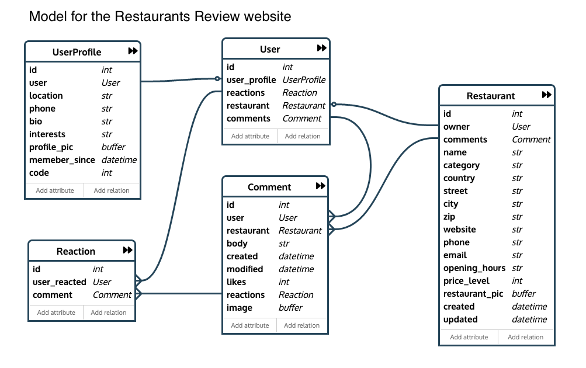

# Restaurant Review Application

A restaurant reviewing web app using React & Redux for the frontend and the Django-REST-Framework and PostgreSQL for the backend. Made during 4 days by a team of 3 coding bootcamp students. 

[API Endpoints](./readme_files/Endpoints.md)

### Models Representation

